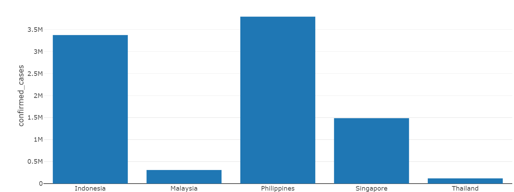
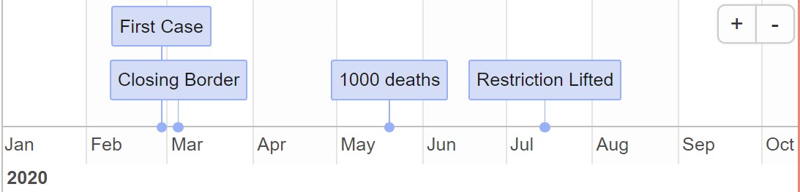
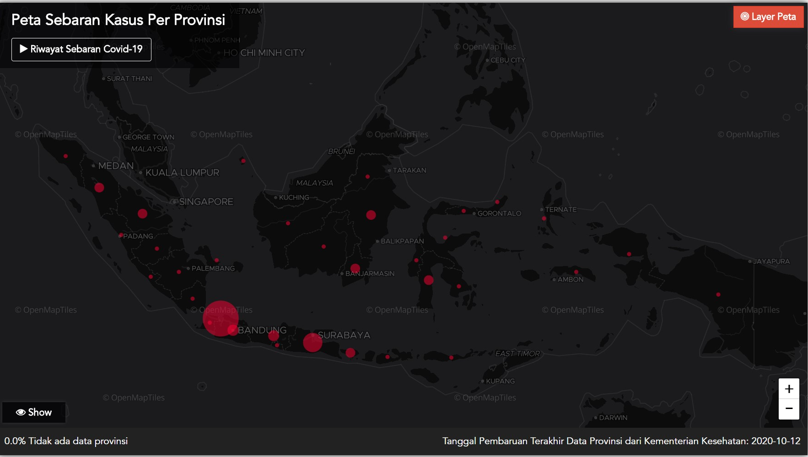

```{r setup, echo=FALSE, warning=FALSE, message=FALSE}
knitr::opts_chunk$set(echo = FALSE, warning = FALSE, message = FALSE)
library(timevis)
```


## Background Story
In the last mid semester break when I was still writing a book about creating a website using Hugo, I got announcement from my lecturer that the assessment for creating a shiny application was available on the course website. I headed to the website and read the instructions for the shiny assessment. Since the intention was generally about making comparison of covid-19 cases, I was thinking about making an application that shows cases development and people's mobility in several ASEAN countries.  

In selecting the countries, I considered one that has moderate to high cases number of covid-19, hence Vietnam which has very low cases was not selected. One of the countries definitely must be my own country Indonesia. Other countries to pick were considered to have cases which are not extremely as low as Vietnam. Hence, I came up with 5 major ASEAN countries comprise of Indonesia, Malaysia, Singapore, Thailand and Philippines. 

In my opinion, this combination of countries is quite good because we can look at the covid-19 development and the response of people from **developing and middle income countries** (Indonesia, Malaysia, Philippines and Thailand) and **a developed and high income country** (Singapore). The idea was to provide visualizations on different progress of outbreak (on the basis of cases number) and help users to analyse on whether people from different country (and income level) react differently. In addition, users can check the immediate impact of a pandemic policy by selecting corresponding date range, for example users can see number of new cases in Singapore and Malaysia after these countries imposed strict restrictions and closed their borders.

## Introduction to the Covid ASEAN Shiny Application :sparkles:
My shiny application has 2 main sections, which are **the control panel (left sidebar)** and **the output panel (main display)**. The control panel (shown in figure \@ref(fig:sidebar)) allows user to select people's mobility categories sourced from Google's community mobility report. These categories are mobility in workstations, parks, stations, groceries, recreations and residentials. In addition, the panel also has option for choosing specific date range for mobility trend and also a feature to display a table contains summary of cases in a particular country.  

On the other hand, the main display provides 3 plots covering total cases number from all countries, cases trend line in a specific country as well as mobility trend. The total cases number plot is a primary plot which can be linked to the secondary plot of cases trend line by clicking on a specific country. This behaviour takes advantage of ```plotly::event_data``` function. The mobility trend (as in figure \@ref(fig:mobil)) shows average trend in people's mobility in several categories and in specific date range that can be chosen from the sidebar.  

```{r sidebar, fig.cap="Control Panel of My Shiny Application", fig.align='center'}  
knitr::include_graphics("sidebar.PNG")  
```
  

```{r mobil, fig.cap="ASEAN People's Mobility Chart", fig.align='center'}
knitr::include_graphics("mobility_plot.PNG")
```

## Self Review
### What is Good about the Application? :sparkling_heart:
Considering the composition of the visualization design, I believe that this shiny application can be quite informative and at the same time still manage to be compact and concise. Users can easily read brief explanations on each of the visualization including how to set parameters of the plots. This is because in designing user interface layout I tried to imagine myself as a general user who have no prior experience in using shiny application. The summary table layout also fit the sidebar but still can give detail information about covid-19 in a selected country, related to total confirmed, recovered and deaths in each month. The reason behind this placement is to enable user to look at the trend line and mobility plots while at the same time see the summary data on the left.  

  

### What Do I Want to Improve? :muscle:
I realize that my shiny application has several issues that can be improved in order to give clearer understanding. Frankly speaking, the first main issue is regarding the first plotly chart that was intended to show total confirmed cases between countries. The plot shows very high number of total cases since I falsely chose a variable to sum up. Rather than summing up new daily cases, I summarized variable "confirmed" which actually contains accumulation cases. Although the plot (shown in figure \@ref(fig:total)) still able to shows "degree of severity" between all countries (which reveals Philippines and Indonesia as the most severe countries regarding the number of cases), it does not provide appropriate total number of cases (I hope my lecturer will not harshly punish me on that slip :sweat_smile:). 

```{r total, fig.cap="Misleading Chart due to Falsely Choose a Variable", fig.align='center'}

```

Moreover, I also think that it maybe better to link between table and the first plot, hence when users click on a country in the first plot it will change not only the trend line plot but also the summary table showing that one particular country.

### Some Possible Elements to Add On :wrench:
Regarding that my shiny application just contains tabular data and visualization, I would like to add a geospasial element to the application. I was thinking to use leaflet map to show locations of these 5 countries but at the moment I just wanted users to focus on the covid-19 data. Having a map element, users will be able to click on the capital of each country to bring them to several plots (i.e. total cases and trend line plots). 

Another feature I want to add is actually timeline events from these ASEAN countries related to the covid policy, i.e. first case, time event of closing international border,  first 1000 cases and lifting the lockdown. For adding this timeline, perhaps I can use timeviz package and put  ```timevisOutput()``` in UI section as well as ```renderTimevis(timevis())``` to the server. Users should be able to interact with the timeline for example by selecting parameter date range to show some milestone events in the period (illustrated in figure \@ref(fig:timevis)). 

```{r timevis, fig.cap="Illustration of Timevis Element", fig.align='center'}

data <- data.frame(
  id      = 1:4,
  content = c("First Case"  , "Closing Border"  ,"1000 deaths", "Restriction Lifted"),
  start   = c("2020-02-28", "2020-03-05", "2020-05-20", "2020-07-15"),
  end     = c(NA          ,           NA, NA, NA)
)


```


### Some Dreamed Features :star2:
Talking about some imaginable features to add on my shiny application, I believe that creating a geospatial plot that covers not only cases in country level but also provincial is very interesting. When users click on a capital city of one country, it will shows information in all provinces to see in which province the outbreak is more concentrated (shown by different circle size for instance as illustrated in figure \@ref(fig:peta)). The main challenges for this is **data availability**. For example in my country, data for all provinces is somehow not publicly shared in a raw data format but instead just shown in a given chart (https://covid19.go.id/peta-sebaran). Other countries also do not provide such provincial information.

```{r peta, fig.cap="Indonesia's Provincial Breakdown of Covid-19 Data", fig.align='center'}

```

Another obstacle is finding geospatial data (i.e. shapefile) for forming a country's map that can be broken down into several provinces. Assuming that the provincial covid data is available (at least for Indonesia) and required maps can be found, I would like to create additional option for users to divide regions further into several level of outbreak represented by colours (green, red and black). ```Green``` colour indicates that one region is considered safe with low cases, while ```red``` is moderate to high cases, and ```black``` represents very high cases and very infectious region. In fact, currently the Government of Indonesia uses the divisions to implement different measures on each regions based on their categories, for example on campus learning is allowed only for green regions. This feature can also be useful for people plan to travel to somewhere in the country.   

## Bibliography

